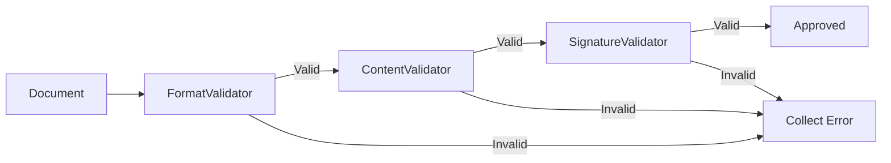

[EN](./README.md) | [UA](./README.uk.md)

# Document Validator

A robust **C++** console application designed to demonstrate the **Chain of Responsibility** design pattern. It provides a system for managing and validating documents through a sequence of strict checks.

---

---

## ✨ Features

- **Chain of Responsibility Pattern**: Validation logic is decoupled into a chain of handlers:
  - `FormatValidator` (Checks for .txt/.pdf)
  - `ContentValidator` (Checks for non-empty content)
  - `SignatureValidator` (Checks if signed)
- **Document Management**: Create, edit, and delete documents.
- **Batch Verification**: Validate all documents against the chain in one go.
- **Filtering**: Search for documents with specific types of errors.
- **Persistence**: Save and load database to/from local file.
- **Localized UI**: Full Ukrainian interface with correct encoding support.

---

## 🏗️ Design Pattern

This project implements the **Chain of Responsibility** pattern to handle compliance checks. Instead of a monolithic validation function, the request (a document) is passed along a chain of validators.

---

## 🚀 How to Run

1.  Open the solution `CourseWork_Chain-of-Responsibility.sln` in **Visual Studio**.
2.  Select **Release** or **Debug** configuration.
3.  Build the solution (Ctrl+Shift+B).
4.  Run the application (F5).

> **Note**: The project is configured to use **UTF-8** for source files and **CP1251** for execution to ensure correct Cyrillic display in the Windows console.

---

## 🛠️ Technology Stack

- **Language**: C++17
- **IDE**: Visual Studio 2022
- **Standard Library**: STL (Smart Pointers, Vectors, Sets, Streams)