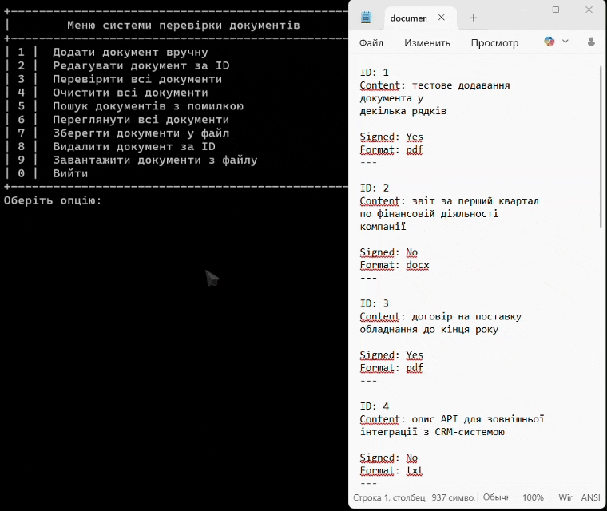

[EN](./README.md) | [UA](./README.uk.md)

# Система Перевірки Документів

Консольний застосунок на **C++**, розроблений для демонстрації патерну проєктування **Ланцюжок обов'язків (Chain of Responsibility)**. Система забезпечує управління та валідацію документів через послідовність перевірок.

---

---

## ✨ Можливості

- **Патерн "Ланцюжок обов'язків"**: Логіка перевірки розділена на окремі ланки:
  - `FormatValidator` (Перевірка формату .txt/.pdf)
  - `ContentValidator` (Перевірка наявності вмісту)
  - `SignatureValidator` (Перевірка наявності підпису)
- **Управління документами**: Створення, редагування та видалення документів.
- **Масова перевірка**: Валідація всіх документів у базі за один прохід.
- **Фільтрація**: Пошук документів за конкретним типом помилки.
- **Збереження даних**: Імпорт та експорт бази документів у файл.
- **Локалізація**: Інтерфейс повністю українською мовою з коректним кодуванням у консолі.

---

## 🏗️ Патерн Проєктування

У цьому проєкті реалізовано патерн **Chain of Responsibility** для обробки перевірок відповідності. Замість єдиної складної функції, запит (документ) передається вздовж ланцюжка валідаторів.

1.  **Формат** — чи є файл текстовим або PDF?
2.  **Вміст** — чи не порожній файл?
3.  **Підпис** — чи підписаний документ?

Якщо документ не проходить одну з перевірок, помилка фіксується, але (в цій реалізації) перевірка може продовжуватись, щоб зібрати всі зауваження.

---

## 🚀 Як запустити

1.  Відкрийте рішення `CourseWork_Chain-of-Responsibility.sln` у **Visual Studio**.
2.  Оберіть конфігурацію **Release** або **Debug**.
3.  Зберіть рішення (Build -> Rebuild Solution).
4.  Запустіть застосунок (F5).

> **Примітка**: Проєкт налаштовано на використання **UTF-8** для вихідного коду та **CP1251** для виконання, що забезпечує коректне відображення кирилиці (української мови) у консолі Windows.

---

## 🛠️ Технологічний Стек

- **Мова**: C++17
- **IDE**: Visual Studio 2022
- **Бібліотеки**: STL (Smart Pointers, Vectors, Sets, Streams)
